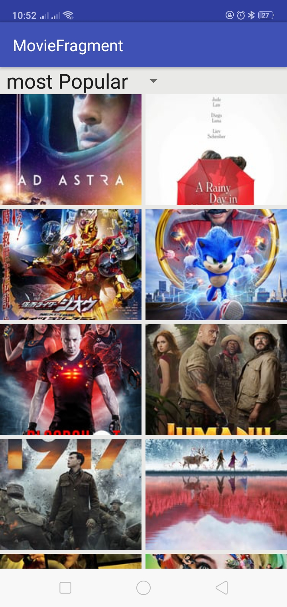
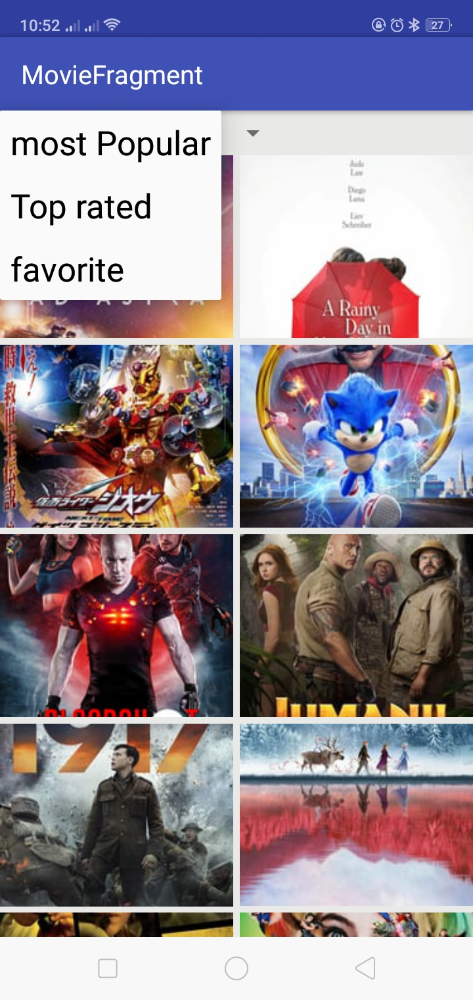
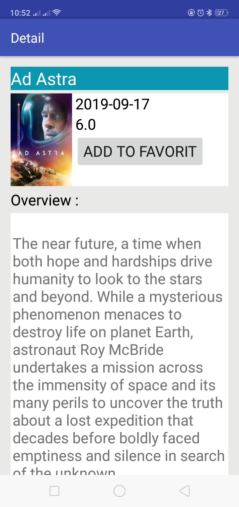
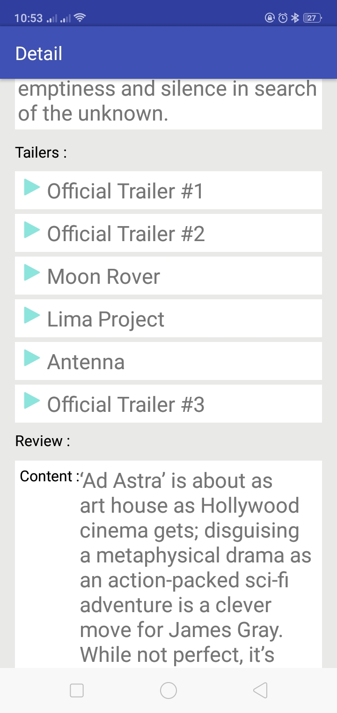

# movie_app
<h2>android movies app display the (most popular/top rated) movies which is Udacity course graduation project</h2>

      

this project is the graduation project for udacity android course you can see all the project spaecification
<a href="https://review.udacity.com/#!/rubrics/67/view">here : </a>

 <h3>project dependencies</h3>
  <ul>
    <li>
<strong>retrofit: </strong>for calling network and parse json data <a href="https://square.github.io/retrofit/">read more about it</a>
<li>
    <li>
<strong>Butter Knife: </strong>to make bind views simpler<a href="https://github.com/JakeWharton/butterknife">read more about it</a>
<li>
    <li>
<strong>Picasso: </strong>to load movie posters from network to the image view<a href=https://square.github.io/picasso/">read more about it</a>
<li>
  </ul>
     
<h3>this app consist of 2 activities</h3>
<ul>
<li>
<h4>the main activity:</h4>

  this activity consist of 2 views   
  <strong>slector:</strong>  it's for the user to choose between the most popular movies or top rated movie 
  <strong>movies grid view:</strong> displays the movies data which recieve as json data 

</li>
  <li>
    <h4>details activity:</h4>
    
this activity consist of 3 parts : 

    <ol>
      <li>poster and movie details part </li>
      <li>movie trailers list</li>
      <li>reviews list</li>
    </ol>
  <li>
</ul>

